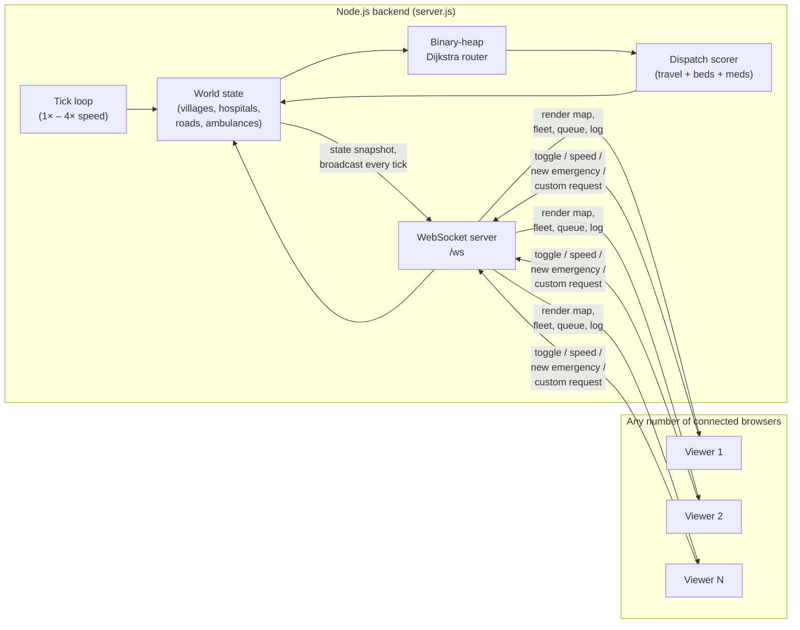

<div align="center">

# 🚑 NERVE — Rural Dispatch Engine

**A real-time ambulance dispatch simulator for rural healthcare access, built on
server-authoritative Dijkstra routing and a live WebSocket feed.**

[](https://nodejs.org)
[](https://expressjs.com)
[](https://github.com/websockets/ws)
[](LICENSE)

[Live Demo](#) · [Features](#features) · [How It Works](#how-it-works) · [Run Locally](#run-locally) · [Deploy](#deploy)

</div>

---

## The Problem

In rural and under-resourced regions, ambulance dispatch is often manual and
reactive: whoever's on shift picks a hospital by gut feeling, without visibility
into which facility is actually closest by *road* (not straight-line distance),
which one has a free bed, which one has the right specialist on duty, and which
one is currently stocked with the medicine the patient will need on arrival.
Wrong calls cost minutes that matter.

**NERVE** simulates that decision in real time: a live map of villages, roads,
and hospitals, an algorithmic dispatcher that scores every viable facility on
travel time + bed availability + specialist match + medicine stock, and a
transparent decision log explaining *why* each call was made — not just what
was decided.

## Features

- **Real Dijkstra routing** — a binary-heap Dijkstra implementation computes true
  shortest paths over a weighted road graph (not straight-line/haversine distance),
  re-routing live around road closures.
- **Multi-factor dispatch scoring** — every request is matched to a hospital by
  a combined cost of travel time, bed occupancy, queue depth, and medicine-stock
  risk, with the losing candidates logged alongside the winner for transparency.
- **Server-authoritative shared simulation** — the entire sim runs once on the
  backend; every connected browser is a live view over WebSocket, so multiple
  judges/viewers watch the exact same ambulances in lockstep.
- **Live operator input** — a request form lets anyone submit a real emergency
  (village, specialty, urgency) that the server validates and injects straight
  into the live dispatch queue, right alongside the simulator's own generated load.
- **Dynamic road network** — random road closures and reopenings force the
  router to recompute paths mid-simulation.
- **SLA tracking** — critical requests are timed against a response-time budget;
  breaches are counted and logged.
- **Zero database, single process** — in-memory shared state, deployable to any
  host that runs a persistent Node process.

## How It Works



- **One simulation, many viewers.** State lives entirely in the Node process.
  Clients never run their own copy of the sim — they render whatever the server
  pushes and send small JSON command packets back (play/pause, speed, force an
  emergency, close a road, submit a custom request).
- **Dispatch scoring**, run fresh for every request:

  ```
  cost = travel_time(Dijkstra) + bed_wait_penalty + queue_penalty + medicine_risk_penalty
  ```

  The lowest-cost eligible hospital wins; the decision log records the runner-up
  and *why* it lost, so every dispatch is auditable.
- **Validated user input.** The request-submission packet
  (`{type: 'custom_request', villageId, specialty, urgency}`) is checked
  server-side against the real world state before it's allowed to become a
  pending request — malformed IDs, unknown specialties, and made-up urgency
  levels are rejected with an error sent back to just that client.

## Tech Stack

| Layer | Choice |
|---|---|
| Backend | Node.js, Express 5 |
| Real-time transport | WebSocket (`ws`) |
| Routing algorithm | Binary-heap Dijkstra (hand-implemented, no external graph library) |
| Frontend | Vanilla JS, HTML5 Canvas — no framework, no build step |
| State | In-memory, single process (no database) |

## Run Locally

```bash
git clone <this-repo-url>
cd <repo>
npm install
npm start
```

Open **http://localhost:3000**. Open it in a second tab and watch both update
in lockstep — that's the shared server state.

## Deploy

This is a standard Node + WebSocket app — deploy anywhere that runs a
persistent process (not serverless/edge, since WebSockets need a long-lived
connection).

**Same-origin (simplest):** deploy the whole repo as one service on
Render / Railway / Fly.io / a VM. `npm install && npm start`, and the frontend
in `public/` is served by the same Express app that runs the sim — no extra
config needed.

**Split hosting (frontend and backend on different domains):** the frontend
reads `window.NERVE_BACKEND_URL` if you need to point it at a backend hosted
elsewhere (e.g. frontend on a static host, backend on Render). Add this before
the script runs:

```html
<script>window.NERVE_BACKEND_URL = "https://your-backend.example.com";</script>
```

If it's undefined, the frontend just talks to whatever origin served the page.

See [`ARCHITECTURE.md`](ARCHITECTURE.md) for more on the WebSocket protocol
and simulation internals.

## Project Structure

```
.
├── server.js           # entire backend: sim engine + Express + WebSocket server
├── public/
│   └── index.html       # frontend: canvas renderer + WS client, no build step
├── package.json
└── ARCHITECTURE.md      # protocol reference + simulation internals
```

## Known Limitations

- No authentication — anyone who can reach the server can pause/reset the sim
  or submit requests for every connected viewer. Fine for a demo; add auth
  before exposing this publicly if that matters for your use case.
- No persistence — restarting the server resets the world. State would need
  to move to Redis/Postgres to survive restarts or scale across instances.

## License

MIT — see [LICENSE](LICENSE).
